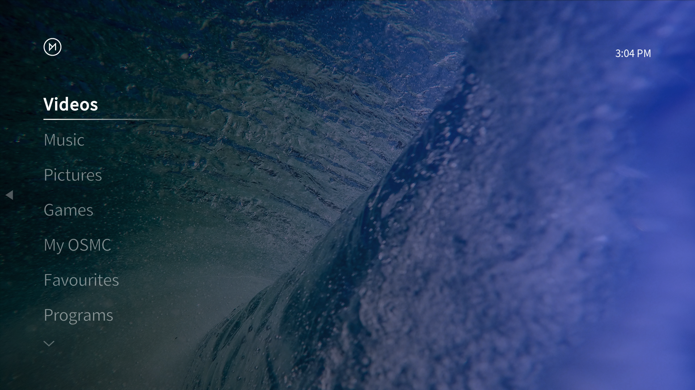

# DRM VC4 screen grabber 

This is an experimental attempt to capture a screenshot from a Raspberry Pi
(also working on rpi 4) that is rendering using the [Direct Rendering
Manager](https://en.wikipedia.org/wiki/Direct_Rendering_Manager). It currently
works by opening the default card adapter, looping through all the planes and
finding the underlying framebuffers. Using the framebuffer it is possible to
determine the buffer handle for the underlying buffer object handle.

The buffer object handle can be mapped to memory using the VC4 specific DRM
API's (see `/usr/include/drm/vc4_drm.h`), specifically using the ioctl
`drm_vc4_mmap_bo`. The memory data is stored using XRGB8888 in little-endian 32
bit words, and is tiled in 32x32 bit squares
([reference](https://docs.mesa3d.org/drivers/vc4.html#tiled-rendering)). There
is also some other interlacing or similar I have not quite figured out yet.

## Compiling

1. Ensure rust is installed (with rustup and cargo). 
2. Install the target toolchain for raspberry pi: `rustup target install armv7-unknown-linux-gnueabihf`.
3. Ensure the linker for this toolchain is installed, e.g. `sudo apt install binutils-arm-none-eabi`
4. Set the linker in your env var: `export CARGO_TARGET_ARMV7_UNKNOWN_LINUX_GNUEABIHF_LINKER=/usr/bin/arm-linux-gnueabihf-gcc`
5. Compile: `cargo build --release --target armv7-unknown-linux-gnueabihf`
6. The built file will be at `target/armv7-unknown-linux-gnueabihf/release/v4lrust`

## Example

The following is an example screen capture in the current codes state.

